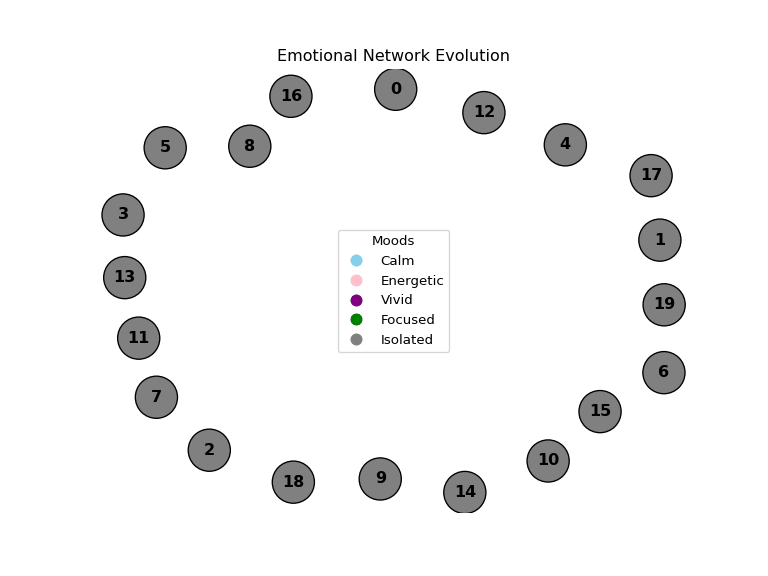

## Abstract

This project presents an agent-based simulation of emotional-social interaction within a speculative 2050 digital society.\
Each agent represents a unique digital persona with mood states, delegation levels, and emotional behavior rules.\
Trust relationships form dynamically through repeated interactions, influenced by mood compatibility and presence authenticity.\
Over time, emergent emotional communities and isolated agents appear, visualized as evolving networks.\
The simulation acts as a behavioral backbone for configuring and testing identity systems within the broader PersonaBuild platform.

## Core ABM Components

| ABM Element | Implementation |
|-----------------------|-------------------------------------------------|
| **Agents** | Each user is modeled as an `Agent` with properties like `mood`, `delegation_mode`, `trust`, and `interaction_log`. |
| **World** | The simulation exists in a digital reality space (metaverse layer) where agents interact. It can represent specific "realities" like Work, Gaming, or Public. |
| **Behavioral Rules** | Defined in the `interact()` function: |
|  | • *Mood Compatibility* → Agents with matching moods build trust faster |
|  | • *Delegation Mode* → Hard Delegation weakens connection strength |
|  | • *Interaction Frequency* → Repeated interactions grow trust over time |
| **Simulation Loop** | Implemented in the `run_simulation()` function. Runs over a set number of steps, allowing agents to repeatedly and randomly interact and evolve emotionally. |
| **Visualization** | Every 20 steps, the simulation generates a snapshot using `matplotlib` + `networkx`, showing agents (as mood-colored nodes) and evolving trust networks. |
| **Emotion Logic** | The `mood_instability()` function allows agents to randomly shift moods, simulating emotional unpredictability and environmental influence. |

## Agent Properties in Detail

```{python}
class Agent:
    def __init__(self, agent_id):
        self.id = agent_id
        self.mood = random.choice(MOODS)
        self.delegation_mode = random.choice(DELEGATION_MODES)
        self.trust = {}  # Trust levels with other agents
        self.interaction_log = {}  # Record of all interactions
```

| **Property** | **Role** |
|------------------------|------------------------------------------------|
| `mood` | Defines the agent’s emotional tone (Calm, Energetic, Vivid, Focused) |
| `delegation_mode` | Defines how actively the agent is present (Live Proxy, Soft Delegation, Hard Delegation) |
| `trust` | Dictates the strength of connection with other agents |
| `interaction_log` | Tracks how often agents interact (relational memory) |

## Behavioral Rules (Model’s Core Intelligence) v1

**Interaction Logic:**

-   Agents form trust through repeated interaction.

-   If moods match, trust increases faster.

-   If either agent is in Hard Delegation, trust growth is penalized (they’re emotionally distant).

-   Interaction frequency is recorded.

**Mood Drift:**

-   Each agent has a small chance to randomly change mood per step — simulating emotional instability or influence from the environment (like news, changes in the virtual world, or social events).

## Network Output: Visualising the Emotional Society

| **Output** | **Meaning** |
|-------------------------|-----------------------------------------------|
| **Nodes** | Each agent, colored by their current mood |
| **Edges** | Trust relationships (thicker = stronger trust) |
| **Clusters** | Groups of agents with shared moods and frequent trust bonds |
| **Isolates** | Agents left out due to delegation distance or mood incompatibility |

## Code

```{python}
import random
import networkx as nx
import matplotlib.pyplot as plt
import matplotlib.animation as animation
from matplotlib.widgets import Button

# moods and colors
MOODS = ['Calm', 'Energetic', 'Vivid', 'Focused']
MOOD_COLORS = {
    'Calm': 'skyblue',
    'Energetic': 'pink',
    'Vivid': 'purple',
    'Focused': 'green',
    'Isolated': 'gray'  # Special color for isolated agents
}
DELEGATION_MODES = ['Live Proxy', 'Soft Delegation', 'Hard Delegation']

class Agent:
    def __init__(self, agent_id):
        self.id = agent_id
        self.mood = random.choice(MOODS)
        self.delegation_mode = random.choice(DELEGATION_MODES)
        self.trust = {}  # Trust with others
        self.interaction_log = {}

# Create agents
def create_agents(num_agents):
    return [Agent(i) for i in range(num_agents)]

# Mood compatibility check
def mood_similarity(mood1, mood2):
    return mood1 == mood2

# Interaction rules
def interact(agent_a, agent_b):
    base_trust_change = 0.05  # base trust change
    if mood_similarity(agent_a.mood, agent_b.mood):
        trust_change = base_trust_change * 2
    else:
        trust_change = base_trust_change * 0.5

    if 'Hard Delegation' in [agent_a.delegation_mode, agent_b.delegation_mode]:
        trust_change *= 0.5  # penalty for ghost mode

    agent_a.trust.setdefault(agent_b.id, 0)
    agent_b.trust.setdefault(agent_a.id, 0)

    agent_a.trust[agent_b.id] += trust_change
    agent_b.trust[agent_a.id] += trust_change

    agent_a.interaction_log[agent_b.id] = agent_a.interaction_log.get(agent_b.id, 0) + 1
    agent_b.interaction_log[agent_a.id] = agent_b.interaction_log.get(agent_a.id, 0) + 1

# Mood instability based on interaction frequency
def mood_instability(agent, instability_rate=0.05):
    total_interactions = sum(agent.interaction_log.values())
    adjusted_instability_rate = instability_rate + (total_interactions / 1000)
    if random.random() < adjusted_instability_rate:
        agent.mood = random.choice(MOODS)

#  trust graph
def build_trust_graph(agents, trust_threshold=0.1):
    G = nx.Graph()
    for agent in agents:
        G.add_node(agent.id, mood=agent.mood)
        for other_id, trust_value in agent.trust.items():
            if trust_value >= trust_threshold:
                G.add_edge(agent.id, other_id, weight=trust_value)
    return G

# Highlight isolated agents based on low interaction or low trust
def get_isolated_agents(agents, trust_threshold=0.1, interaction_threshold=2):
    isolated_agents = []
    for agent in agents:
        if len(agent.trust) == 0 or all(trust < trust_threshold for trust in agent.trust.values()):
            if sum(agent.interaction_log.values()) < interaction_threshold:
                isolated_agents.append(agent.id)
    return isolated_agents

# Improved node visualization:  node size, color, and border
def draw_graph(G, ax, isolated_agents):
    pos = nx.spring_layout(G, seed=42)
    
    node_colors = [MOOD_COLORS[G.nodes[n]['mood']] if n not in isolated_agents else 'gray' for n in G.nodes()]
    
    node_sizes = [1000 + sum(G[node][neighbor]['weight'] for neighbor in G[node])*200 for node in G.nodes()]
    
    edges = G.edges()
    edge_widths = [G[u][v]['weight'] * 5 for u, v in edges]
    
    nx.draw(G, pos, ax=ax, with_labels=True,
            node_color=node_colors, node_size=node_sizes,
            edge_color='gray', width=edge_widths,
            font_size=12, font_weight='bold',
            edgecolors='black', font_color="black")
    
    edge_labels = {(u, v): f"{G[u][v]['weight']:.2f}" for u, v in G.edges()}
    nx.draw_networkx_edge_labels(G, pos, edge_labels=edge_labels)
    
    ax.set_title("Emotional Network Evolution")
    
    handles = [plt.Line2D([0], [0], marker='o', color='w', markerfacecolor=color, markersize=10) 
               for color in MOOD_COLORS.values()]
    labels = list(MOOD_COLORS.keys())
    ax.legend(handles, labels, title="Moods")

#  simulation and capture frames
def run_simulation(agents, steps, interval=20):
    frames = []
    for step in range(steps):
        agent_a, agent_b = random.sample(agents, 2)
        interact(agent_a, agent_b)

        for agent in agents:
            mood_instability(agent)

        if step % interval == 0:
            G = build_trust_graph(agents)
            isolated_agents = get_isolated_agents(agents)
            frames.append((G, isolated_agents))
    
    print(f"Frames captured: {len(frames)}")  # Debugging: Print the number of frames captured
    return frames
  
# update function for animation
def update_graph(i, ax, frames):
    ax.clear()  # Clear the previous frame
    G, isolated_agents = frames[i]  # Get the graph and isolated agents for this frame
    draw_graph(G, ax, isolated_agents)  # Redraw the graph with updated data


# animation
def save_animation(frames, filename="animation.gif"):
    fig, ax = plt.subplots(figsize=(8, 6))

    anim = animation.FuncAnimation(
        fig, lambda i: update_graph(i, ax, frames), frames=len(frames), interval=500, repeat=False, blit=False
    )

    #  animation as a GIF
    anim.save(filename, writer='imagemagick', fps=5)  

```

```{python}

agents = create_agents(20)
frames = run_simulation(agents, steps=500, interval=20)
save_animation(frames, filename="my_simulation.gif")

```



## **Inferences and Insights from the Simulation Output**

By analyzing the network visualization and output GIF, several key insights can be drawn:

1.  **Social Dynamics**:

    -   **Emotional Compatibility**: Agents with similar moods tend to cluster together, building stronger relationships faster. This suggests that emotional compatibility plays a crucial role in fostering **community cohesion**.

    -   **Emotional Distance**: Agents in **Hard Delegation** modes maintain weaker trust bonds. This highlights the importance of **emotional engagement** in creating meaningful connections in a community.

2.  **Emergent Communities**:

    -   Groups of agents with shared moods naturally form. These clusters represent emotional **subgroups** that evolve based on mood compatibility and interaction frequency.

    -   **Subgroups** can emerge from **shared values or emotional states**, providing insight into how communities in virtual environments can form organically.

3.  **Isolation**:

    -   Agents that remain **isolated** throughout the simulation typically have either low interaction or incompatible moods. This highlights the challenges of **engagement** and **connection** in social platforms.

    -   **Isolated agents** may require intervention strategies (e.g., connecting them with similar agents) to reduce their isolation.

4.  **Trust Dynamics**:

    -   **Trust growth** is influenced by repeated interactions. Agents with similar moods form stronger trust bonds, while those with mismatched moods build trust more slowly.

    -   This suggests that **trust-building** in digital platforms (or virtual communities) can be accelerated by fostering mood compatibility or facilitating **more frequent interactions**.

## **Applications and Next Steps**

-   **Identity Systems Design**: The insights on emotional engagement and trust can inform the design of **identity systems** within **PersonaBuild**.

-   **Engagement Strategies**: Understanding emotional compatibility and trust dynamics helps in designing engagement strategies that encourage **social interaction** and **reduce isolation** in digital communities.

-   **Platform Improvements**: Insights on **isolated agents** can help refine platform features to ensure users are **emotionally engaged** and not left out due to incompatibilities.
